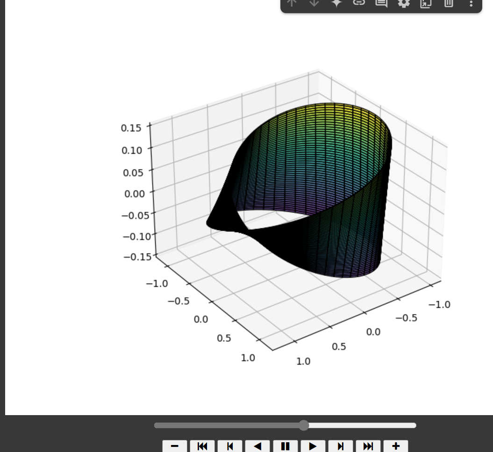

# Möbius Strip Visualization 🌀

This project models and visualizes a **Möbius strip** using parametric equations in Python. It includes a rotating 3D animation and surface geometry calculations.

## 📂 Files

- `mobius_strip.py` — Main Python script
- `README.md` — This file

## 📽️ Try It Online

[](https://colab.research.google.com/drive/17Zavz-6n2aAtM9_EN48CM0-3cW8QXG3g?usp=sharing)

> ⚠️ Colab version may exclude animation output if outputs are cleared to reduce file size.

## 📐 Features

- Models Möbius strip using parametric equations
- Computes surface area and edge length numerically
- 3D static plot + rotating animation

## 🚀 How to Run

```bash
pip install numpy matplotlib
python mobius_strip.py

```


## 🖼️ Screenshot

Here’s what the 3D Möbius Strip looks like:

